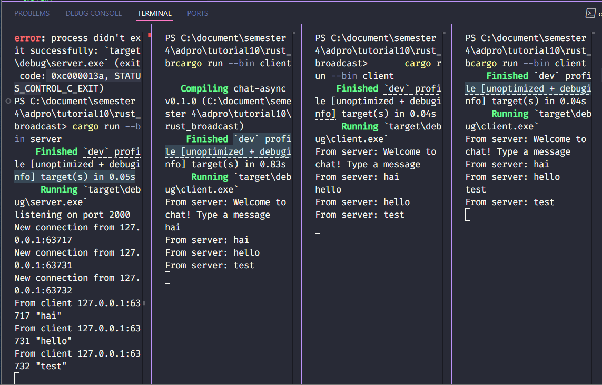

# 2.1 Original code and how to run it.

Program ini membangun sistem chat interaktif menggunakan WebSocket dan Rust, dengan arsitektur terdiri dari server yang mengelola koneksi dan klien yang memungkinkan pengguna berkirim pesan. Saat server aktif di port 2000, setiap klien yang terhubung mendapat ucapan selamat datang. Ketika salah satu klien mengirim pesan, server meneruskannya ke semua klien aktif, termasuk pengirimnya, dengan format "From server: [pesan]". Hal ini terlihat saat tiga klien berbeda masing-masing mengirimkan pesan seperti "Hello!", "Hai", dan "test", yang kemudian diterima serempak oleh semua klien. Implementasi ini memanfaatkan Tokio untuk menangani berbagai koneksi secara asinkron, baik di sisi server yang mendistribusikan pesan menggunakan tokio::select! dan saluran broadcast, maupun di sisi klien yang secara paralel membaca input pengguna dan pesan masuk dari server. Hasilnya adalah sistem chat efisien yang mampu menangani banyak pengguna tanpa blocking.