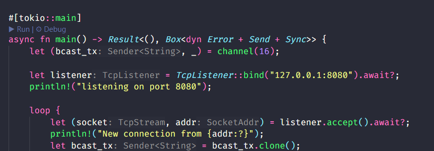
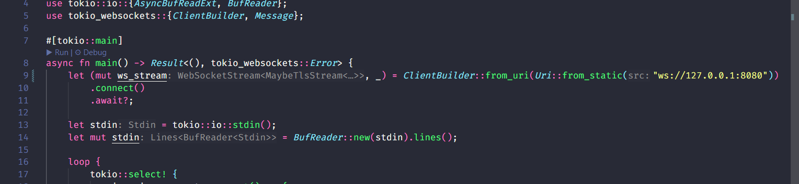
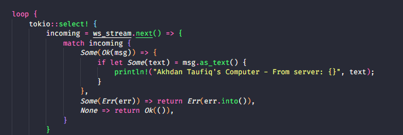
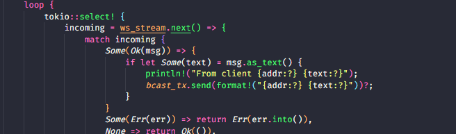

# 2.1 Original code and how to run it.

Program ini membangun sistem chat interaktif menggunakan WebSocket dan Rust, dengan arsitektur terdiri dari server yang mengelola koneksi dan klien yang memungkinkan pengguna berkirim pesan. Saat server aktif di port 2000, setiap klien yang terhubung mendapat ucapan selamat datang. Ketika salah satu klien mengirim pesan, server meneruskannya ke semua klien aktif, termasuk pengirimnya, dengan format "From server: [pesan]". Hal ini terlihat saat tiga klien berbeda masing-masing mengirimkan pesan seperti "Hello!", "Hai", dan "test", yang kemudian diterima serempak oleh semua klien. Implementasi ini memanfaatkan Tokio untuk menangani berbagai koneksi secara asinkron, baik di sisi server yang mendistribusikan pesan menggunakan tokio::select! dan saluran broadcast, maupun di sisi klien yang secara paralel membaca input pengguna dan pesan masuk dari server. Hasilnya adalah sistem chat efisien yang mampu menangani banyak pengguna tanpa blocking.

# Experiment 2.2: Modifying port.

Untuk memastikan program chat menggunakan WebSocket tetap berjalan dengan baik setelah mengubah port menjadi 8080, penyesuaian perlu dilakukan di kedua sisi, yakni server dan client. Ini karena WebSocket merupakan protokol dua arah—client membuka koneksi, dan server harus mendengarkan pada port yang sama. Dalam kasus ini, port awal yang digunakan adalah 2000, dan diubah ke 8080. Oleh karena itu, URI pada client.rs harus diperbarui agar mencocokkan port baru tersebut. Perubahan ini penting agar saat client mencoba terhubung, server benar-benar sedang mendengarkan pada port yang sama.

Selain itu, konsistensi protokol juga dijaga dengan menggunakan skema ws:// pada URI di ClientBuilder, yang menunjukkan bahwa koneksi yang dibangun adalah melalui WebSocket, bukan protokol lain seperti HTTP biasa. Dengan protokol dan port yang telah disamakan di kedua file (client.rs dan server.rs), maka ketika program dijalankan kembali, koneksi antara client dan server akan berhasil terhubung tanpa kendala. Hal ini menegaskan bahwa sinkronisasi port dan protokol adalah hal krusial dalam komunikasi berbasis WebSocket.

# Experiment 2.3: Small changes, add IP and Port

Saya memodifikasi bagian server karena sekarang server mencatat asal pesan berdasarkan alamat klien. Saat klien terhubung, server membuat thread asinkron khusus untuk menangani aliran pesan dari klien tersebut. Alamat klien (host) disimpan melalui variabel addr, yang kemudian digunakan untuk menandai setiap pesan saat dikirim kembali ke semua klien. Dengan cara ini, setiap pesan yang dibroadcast bisa dikenali berasal dari siapa, tanpa perlu mekanisme tambahan.